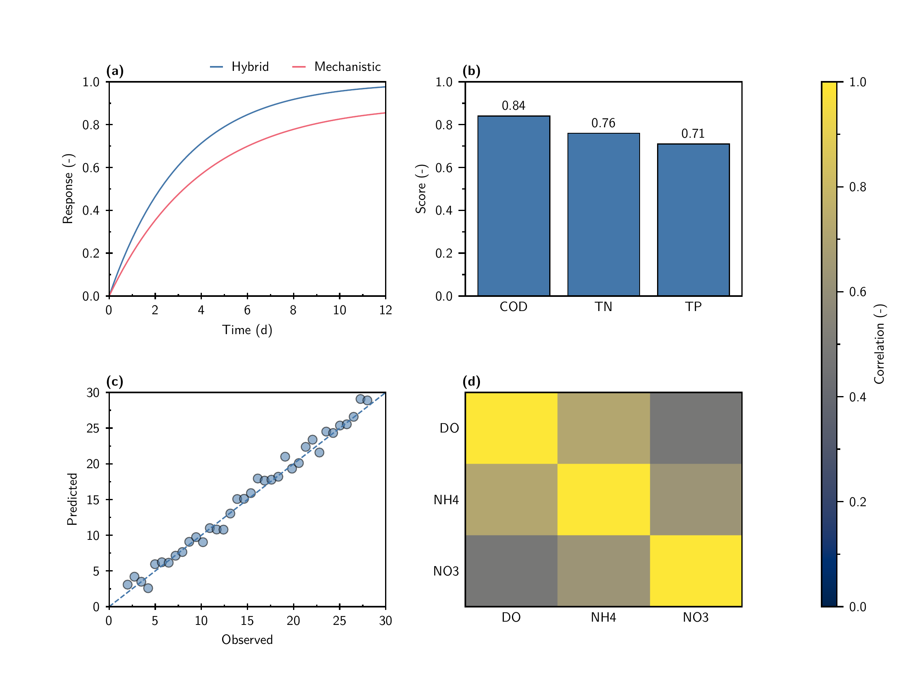

# AxiomFig

AxiomFig is a deterministic-first Agent Skill for publication-quality scientific figures. Scientific meaning stays in a small set of native Matplotlib builders; all reusable visual decisions come from three YAML contracts and thin helpers.



## Architecture

```text
styles/style.yaml ─┐
styles/fonts.yaml ─┼─> thin YAML loader -> rcParams/tokens -> template family
styles/colors.yaml ┘                              -> Matplotlib vector PDF
                                                   -> Tectonic final PDF
                                                   -> Poppler preview PNG
```

The three canonical sources have exclusive responsibilities:

- `style.yaml`: geometry, physical font sizes, strokes, ticks, nice axes, legends, panels, plot defaults, and rendering;
- `fonts.yaml`: exact Latin/math/mono families, files, sources, licenses, redistribution status, and optional system fonts;
- `colors.yaml`: canonical scientific palettes.

There are no `.mplstyle` layers. The public templates are grouped into four modules under `src/axiomfig/templates/` and expose only `line`, `scatter`, `bar`, `violin`, `heatmap`, and `multi-panel`.

## Quick start

Requirements are Python 3.11+, Tectonic, Poppler, PyYAML, and the exact fonts selected by the typography contract.

```bash
brew install tectonic poppler
python -m pip install -e .

python scripts/check_fonts.py
python scripts/render.py line --output "$PWD/tmp/demo/line" \
  --geometry single-column --typography sans
python scripts/validate.py tmp/demo
```

Installed commands are `axiomfig-render`, `axiomfig-validate`, and `axiomfig-gallery`.

## Frozen visual contract

- Physical widths are 90, 140, and 190 mm at default 4:3; point sizes do not scale with width.
- `main_stroke = 0.8 pt`; black filled-geometry edges use `fill_edge = 0.6 pt`.
- Open continuous axes use major `inout`, minor `in`, and one minor per major interval. Filled surfaces use major/minor `out`; categorical axes keep labels but no tick marks.
- Nice linear axes target 5–7 majors with steps limited to `1`, `2`, `2.5`, or `5 × 10^n`, half-step minors, and snapped limits.
- Single-series figures omit legends. Multi-series legends sit outside top-right, prefer one row, align to the right spine, and reduce columns only on measured overflow.
- Panel labels are bold `(a)`, `(b)`, … at `10 pt` with fixed point offsets. Ordinary panel boxes remain identical; colorbars occupy dedicated layout slots.
- Scatter uses black `0.6 pt` edges, alpha `0.55`, and `28 pt²` markers. Bars and violins use black `0.6 pt` edges; bars show two-decimal values.
- `sans` uses Latin Modern Sans; `serif` uses Latin Modern Roman; both use Latin Modern Math and Maple Mono. CJK/Japanese work is deferred.

See [SKILL.md](SKILL.md), [the style contract](references/style-contract.md), [typography](references/typography.md), [layout](references/layout.md), and [template families](references/templates.md).

## LaTeX boundary

[The LaTeX contract](references/latex-contract.md) records exact allowed syntax for `siunitx`, `mhchem`, `amsmath`, `unicode-math`, and `xcolor`. The stable renderer embeds Matplotlib text before Tectonic wraps the intermediate PDF, so TeX-native macro expansion inside plot labels remains **DEFERRED**.

## Gallery and validation

The committed Gallery contains matching English-only suites under `gallery/sans/` and `gallery/serif/`, each with six PDF/PNG pairs from `01_line` through `06_multi_panel`.

```bash
python scripts/generate_colors.py --check
python scripts/check_fonts.py
python scripts/build_gallery.py
python scripts/validate.py gallery
python -m pytest -q
ruff check .
ruff format --check .
```

Tests cover deterministic normal, boundary, and overflow/error behavior. The one real-PDF E2E covers the canonical Gallery. Completion still requires human inspection of every final PNG for strokes, ticks, categorical axes, marker/bar/violin edges, labels, legends, panel symmetry, colorbar layout, clipping, and sans/serif consistency.
