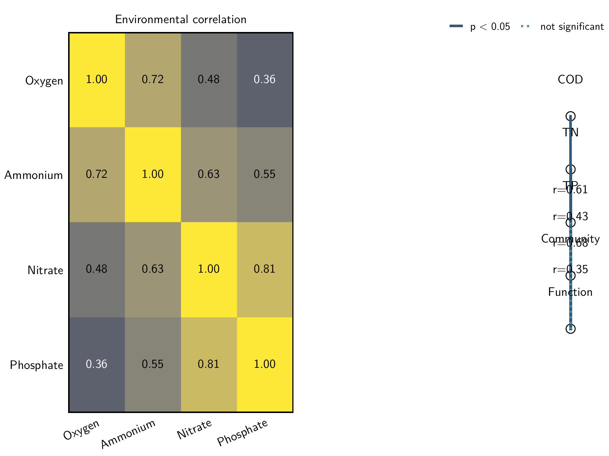
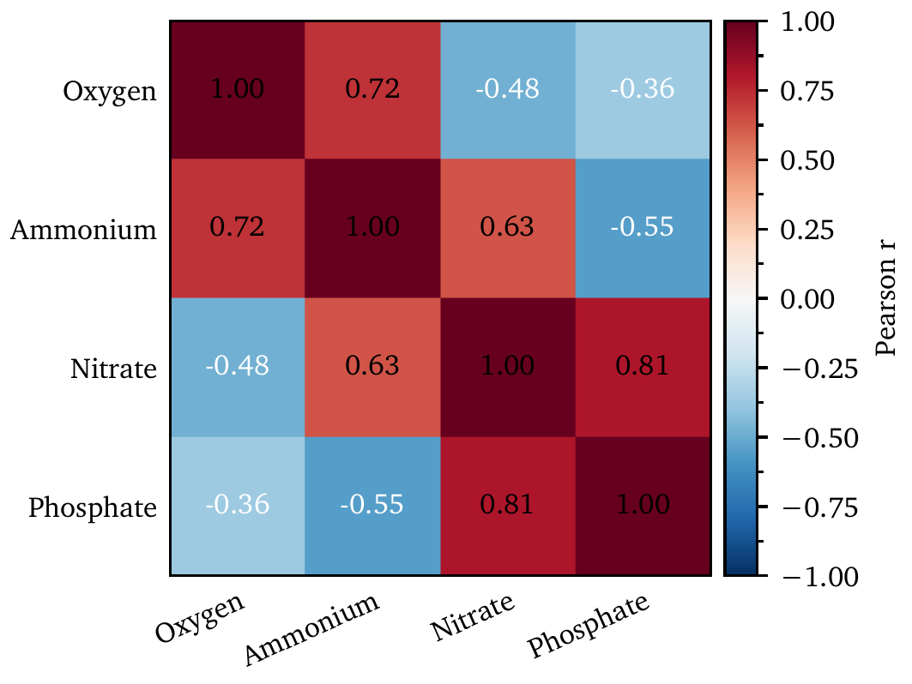

# AxiomFig

AxiomFig is a deterministic scientific-figure system and Agent Skill for publication-oriented,
mostly 2D graphics. An LLM supplies scientific intent, data mapping, template choice, and explicit
scientific semantics; AxiomFig owns geometry, typography, colors, strokes, ticks, legends, panel
layout, colorbars, PDF production, and validation.





## Why deterministic-first

Visual properties that can be derived consistently should not consume Agent tokens or become
one-off Matplotlib decisions. The v1 execution path is:

```text
scientific request
  -> minimal Figure Intent
  -> Template Knowledge route when selection is unclear
  -> compact Template Registry + one family contract
  -> canonical builder
  -> deterministic style/layout/rendering runtime
  -> runtime validator
  -> publication-size PDF + PNG preview
```

`styles/style.yaml`, `styles/fonts.yaml`, and `styles/colors.yaml` are the only visual configuration
sources. Templates own plot grammar and scientific roles, not font size, stroke, spacing, palette
values, or ornament coordinates. The implementation follows explicit Figure/Axes/Artist ownership,
physical units, constrained layout, semantic color, coherent typography, and vector-first QA.

## Installation

Python 3.11+ is required. Formal PDF output additionally needs Tectonic and Poppler.

```bash
brew install tectonic poppler
python -m pip install .
```

For development:

```bash
python -m pip install -e ".[dev]"
```

The wheel bundles redistributable Latin/math/mono fonts and license notices, LaTeX resources,
styles, template contracts, the Knowledge index, and the Evaluation corpus. It does not require the
repository root after installation.

## Quick start with Figure Intent

Figure Intent maps scientific roles to CSV columns or JSON keys and omits derivable visual values:

```yaml
template: scatter.parity
data:
  observed: observed
  predicted: predicted
geometry: single-column
typography: sans
```

```bash
axiomfig-intent examples/parity-intent.yaml \
  --data examples/parity-data.csv \
  --output output/parity
```

This produces and validates `output/parity.pdf` and `output/parity.png`. See the
[Figure Intent contract](references/figure-intent.md). All 55 public templates accept external
mapped data: 28 consume direct user data and 27 consume explicit precomputed scientific results.
Every public template also retains a deterministic canonical example. Unsupported or malformed
roles fail explicitly instead of being ignored.

```bash
axiomfig-render association/mantel --output output/mantel \
  --geometry onehalf-column --typography serif
axiomfig-validate output
```

Installed commands are `axiomfig-intent`, `axiomfig-render`, `axiomfig-validate`, and
`axiomfig-gallery`.

## Template system

The compact [registry](src/axiomfig/templates/index.yaml) exposes 55 public variants across 13
families:

| Family | Count | Scope |
|---|---:|---|
| line | 7 | trends, markers, bands, error bars, steps, areas |
| scatter | 6 | simple/grouped relationships, regression, parity, bubbles, hexbin |
| bar | 6 | vertical/horizontal, grouped/stacked/normalized, dot |
| distribution | 8 | histogram, density, ECDF, box, violin, strip, raincloud |
| heatmap | 5 | basic, annotated, correlation, preordered cluster, confusion matrix |
| estimation | 3 | point intervals, forest, coefficients |
| diagnostics | 8 | residual, QQ, agreement, calibration, ROC/PR, learning, importance |
| ordination | 4 | PCA scores/biplot, PCoA, NMDS for precomputed coordinates |
| association | 2 | Mantel and sparse correlation network |
| flow | 1 | dependency-free Sankey |
| field | 2 | contour and quiver |
| omics | 2 | volcano and enrichment dot |
| survival | 1 | Kaplan–Meier with censoring |

Four registered `layouts` capabilities are composition tools, not plot families. Registry,
contracts, explicit builder maps, and Gallery coverage must agree exactly. Read the
[template contract](references/template-contract.md), [taxonomy](references/template-taxonomy.md),
and [journal-informed census](references/journal-plot-taxonomy.md).

## Progressive disclosure for Agents

[`SKILL.md`](SKILL.md) is the routing entry point. A normal request reads the Skill, the 90-line
registry, and one selected family contract. If the plot choice is unclear, the Agent reads the
15-line [Knowledge index](references/template-knowledge/index.yaml) and only its routed topic.
Builder source and the entire Knowledge Base are not normal prompt context.

Current prompt-side sizes are measured by the Evaluation suite for the Skill, Registry, one selected
family contract, and one representative Figure Intent. The byte/4 estimate is reported by the final
release evaluation rather than maintained as a second hand-written constant here.

## Deterministic visual contract

- widths are 90, 140, and 190 mm at default 4:3; physical point sizes do not scale;
- `main_stroke = 0.8 pt`; filled geometry uses an opaque black `fill_edge = 0.6 pt`;
- open continuous axes use major `inout`, minor `in`, one half-step minor, and deterministic nice
  limits; filled surfaces use outward ticks and categorical marks are suppressed;
- single-series legends are omitted; multi-series legends are measured outside top-right ornaments;
- equal Outer Panel Footprints own Primary/Auxiliary Axes; colorbars remain contained;
- bold 11 pt panel labels anchor `-1/+1 pt` from the Primary Axes frame upper-left;
- qualitative, sequential, diverging, and cyclic colormap semantics come from `colors.yaml`;
- PDF is the formal output; PNG is rasterized from that PDF.

## Gallery, validation, and evaluation

Gallery is generated only from the public registry. `gallery/sans/` and `gallery/serif/` each
contain 55 PDF/PNG pairs with identical family trees; `gallery/technical/latex/` contains two
Tectonic-native pairs. There are 112 pairs and 224 final artifacts, with no numeric flat names or
orphan examples.

Runtime validation covers anatomy and ownership, unequal panels, clipping and overflow, colorbar
containment, legend/panel-label/annotation collisions, physical PDF geometry, embedded subset fonts,
Type 3 rejection, and text page boundaries. The deterministic Evaluation corpus contains one true
external-data Figure Intent for each of the 55 public templates. It reports routing, canonical
rendering, external-data rendering, runtime validation, seven complex-template repeatability checks,
Gallery coverage, and prompt-side size separately.

```bash
python scripts/generate_colors.py --check
python scripts/check_fonts.py
python scripts/check_latex.py
python scripts/validate_skill.py
python scripts/evaluate_release.py --output tmp/evaluation
python -m pytest -q
ruff check .
ruff format --check .
```

## Typography and LaTeX boundary

`sans` uses bundled Latin Modern Sans; `serif` uses bundled XCharter and XCharter Math; both use
bundled Maple Mono. Arial, Times New Roman, SimSun, and Yu Gothic remain optional system-font
metadata with `bundled: false`. Matplotlib embeds plot text before the separate Tectonic wrapper;
only `gallery/technical/latex/` is genuinely TeX-native. See [typography](references/typography.md)
and the exact [LaTeX contract](references/latex-contract.md).

## v1 limitations

Full CJK/Japanese typography, TeX-native Matplotlib labels, animation, interactive dashboards, a
large 3D suite, microscopy/image processing, chemical structure drawing, and GIS are outside v1.
Statistical calculations such as Mantel,
ordination, adjusted p-values, confidence intervals, and survival estimates remain separate from
visualization and must be supplied explicitly.

## Development and release readiness

See [CONTRIBUTING.md](CONTRIBUTING.md) and [SECURITY.md](SECURITY.md). Fast CI runs install, Ruff,
non-E2E tests, Skill validation, deterministic routing evaluation, all 55 lightweight external-data
Figure Intent paths, and a headless smoke render on Python 3.11/3.12. Local release validation adds
55 Tectonic PDF/PNG data-path renders, full Gallery E2E, font and LaTeX probes, isolated wheel
installation, fresh-clone workflow tests, and final visual review.
