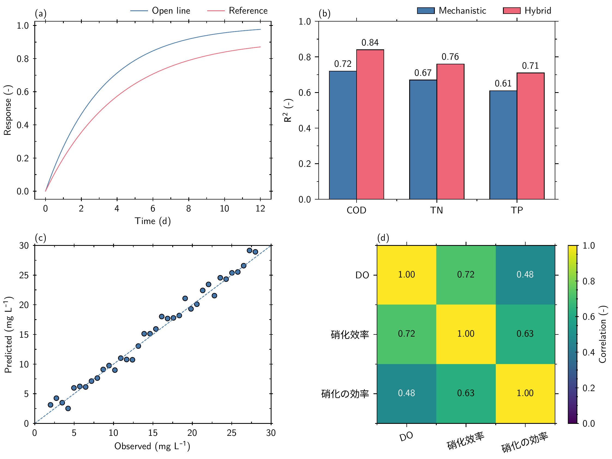

# AxiomFig

AxiomFig is a deterministic-first Agent Skill for publication-quality scientific figures. The agent interprets data and scientific intent, selects a native Matplotlib template, composes tested style modules, and runs one rendering and validation pipeline. Visual choices that can be fixed are encoded as styles and thin helpers instead of being re-invented per plot.



## Architecture

```text
scientific intent -> native template -> composed .mplstyle modules
                  -> deterministic helpers -> Matplotlib vector PDF
                  -> standalone includegraphics wrapper -> Tectonic final PDF
                  -> Poppler preview + validation

canonical Paul Tol colors -> Matplotlib .mplstyle
                          -> generated LaTeX xcolor definitions
```

`src/axiomfig/` remains a thin deterministic layer: style conflict detection, exact font discovery, artist typography, layout/plot helpers, Tectonic execution, gallery orchestration, and artifact validation. Plot grammar remains in runnable files under `templates/`.

## Quick start

Requirements are Python 3.11+, Tectonic, Poppler, and the exact fonts selected by the typography contract. AxiomFig uses standard Python package metadata and does not require a particular environment manager.

```bash
brew install tectonic poppler
python -m pip install -e . --group dev

python scripts/check_fonts.py
python scripts/render.py line-ci --output "$PWD/tmp/demo/line" \
  --geometry single-column --typography sans \
  --colors default --plot line
python scripts/validate.py tmp/demo
```

`check_fonts.py` checks the default `sans` contract. The full gallery and test suite exercise both `sans` and `serif`; exact families and explicit serif validation are in [the typography contract](references/typography.md).

Compose an inspectable style without rendering:

```bash
python scripts/compose_style.py \
  --geometry double-column --typography serif --colors muted \
  --plot line --language multilingual --rendering vector \
  --output tmp/composed.mplstyle
```

Layer order is fixed: `base -> geometry -> typography -> colors -> plot -> language -> rendering`. Undeclared duplicate keys fail; declared plot tick-direction overrides are deterministic. See [the style contract](references/style-contract.md).

## Frozen visual contracts

- Linear open surfaces use one minor tick between adjacent major ticks, major `inout`, minor `in`; filled surfaces use major/minor `out`. Log axes retain their mathematical locator.
- Every default visible stroke uses the central `0.6 pt` token, including spines, lines, ticks, marker/bar edges, error bars, caps, and reference strokes.
- Panel labels align to the left spine at a uniform `2 pt` physical gap. Legends start in one row above the axes, right-align to the right spine, and reduce columns only when measured width requires it.
- Bars have black `0.6 pt` edges and fixed-precision labels (`decimals=2` by default). Scatter markers have black `0.6 pt` edges.
- Unqualified AxiomFig color use means the canonical `default` Paul Tol bright qualitative palette. `muted` and `colorblind` are explicit opt-ins. Matplotlib styles and default LaTeX xcolor definitions are generated from the same Python source.
- A figure selects one complete `sans` or `serif` family. Titles, labels, ticks, legends, panel labels, annotations, math, Chinese, and Japanese follow that mode; Maple Mono is reserved for code/identifier roles.

The exact helper APIs and limits are routed from [SKILL.md](SKILL.md) to [layout](references/layout.md), [colors](references/colors.md), [typography](references/typography.md), and [templates](references/templates.md).

## LaTeX and Tectonic boundary

The wheel packages `axiomfig.sty` and a generated `axiomfig-colors.tex`. Color generation and tests verify that the xcolor definitions exactly match the canonical Matplotlib palette. A separate standalone Tectonic probe verifies `siunitx`, `mhchem`, and math semantics with embedded, subset, Unicode-mapped, non-Type-3 fonts:

```bash
python scripts/check_latex.py
```

This does not make Matplotlib-internal label strings TeX-native. In the production renderer, text is already shaped into `intermediate.pdf`; the outer wrapper only includes that graphic. Matplotlib 3.10.9 rejects `tectonic` as a PGF TeX system, MathText rejects `\qty`, and the wrapper cannot retroactively expand `\qty` or `\ce`. Native label macro expansion is therefore **TECHNICALLY BLOCKED / DEFERRED**. See [the LaTeX contract](references/latex.md).

## Gallery and validation

The committed gallery contains exactly ten final PDF/PNG pairs: `01_line` through `08_multi_panel`, plus `09_serif` and the four-panel `10_style_contract` acceptance figure. Intermediates remain under ignored `tmp/`.

```bash
python scripts/generate_colors.py --check
python scripts/check_fonts.py
python scripts/check_latex.py
python scripts/build_gallery.py
python scripts/validate.py
python -m pytest -q
ruff check .
ruff format --check .
```

Automated checks cover deterministic mechanics and PDF evidence. Visual quality still requires opening the rasterized gallery and checking family uniformity, CJK glyphs, panel/legend geometry, tick directions, clipping, overlap, and whitespace. See [rendering and validation](references/rendering-validation.md).
