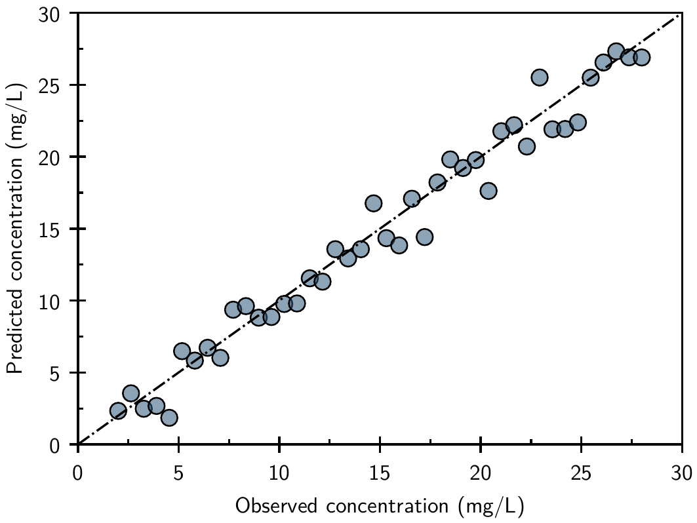
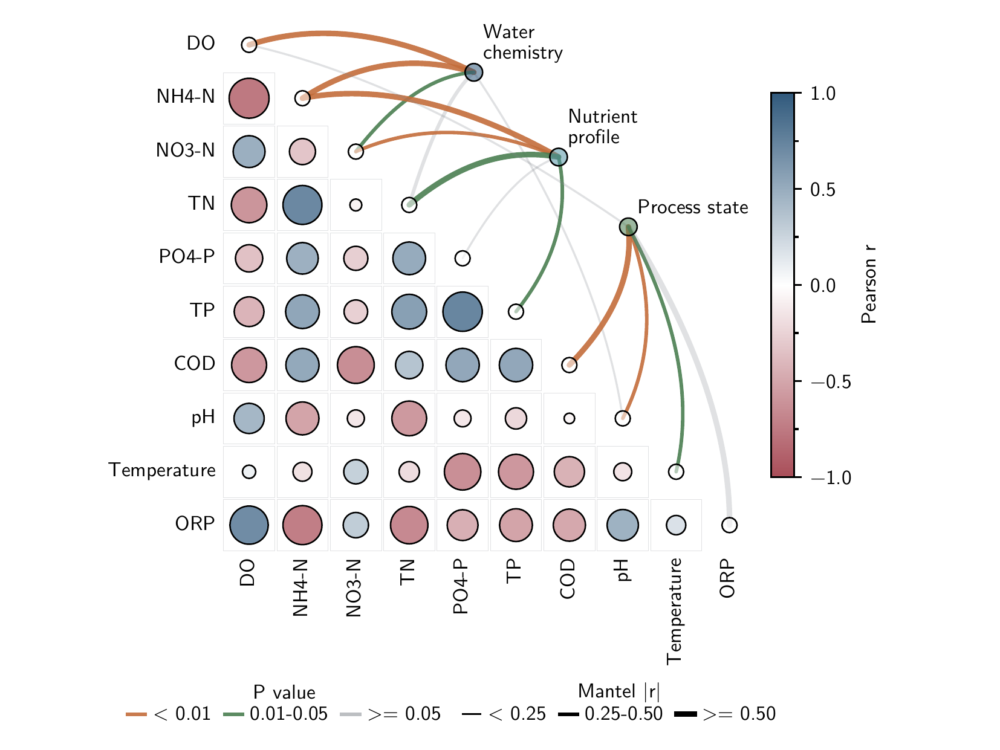
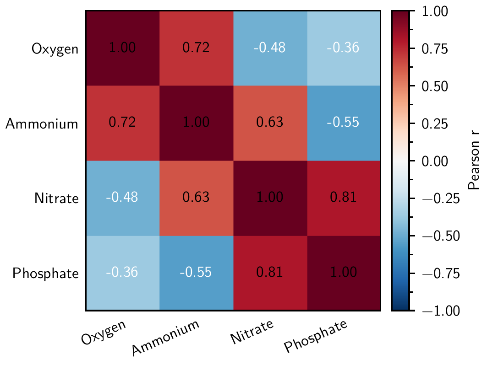

# AxiomFig

AxiomFig is a deterministic-first scientific figure system for LLM agents and researchers. It
turns a compact scientific Figure Intent into publication-oriented PDF and PNG output while keeping
geometry, typography, color, ornaments, and validation out of the prompt.

## Why AxiomFig

- **Deterministic-first:** any visual property that can be derived does not consume Agent tokens.
- **Publication-oriented:** physical sizes, vector PDF, embedded fonts, and fixed visual contracts.
- **Scientifically explicit:** uncertainty, color semantics, and precomputed analyses remain named.
- **Agent-efficient:** discover 55 templates from one small registry, then read one family contract.
- **Validated:** figures fail on known containment, collision, font, or PDF-boundary defects.

## Installation

AxiomFig has two deliberate parts: this repository is the Agent Skill (`SKILL.md`, references, and
recommendation knowledge), while the Python package is the deterministic runtime and CLI. A pip
install alone does not install the Skill documents. Keep a Skill checkout available to the Agent
and install the runtime into its execution environment.

AxiomFig requires Python 3.11 or 3.12, Tectonic, and Poppler. On macOS, the v1.1.0 runtime can be
installed with:

```bash
brew install tectonic poppler
python -m pip install "axiomfig @ git+https://github.com/cigit-zgy/axiomfig-skill.git@v1.1.0"
```

For a source checkout, run `python -m pip install -e .` from the repository root.

## 60-second Quick Start

The committed parity example is the complete user-facing path:

```bash
axiomfig-intent examples/parity/intent.yaml \
  --data examples/parity/data.csv \
  --output parity
```

This writes `parity.pdf` and `parity.png`, then validates the final PDF/PNG pair. The Figure Intent
contains only scientific mapping and publication mode:

```yaml
template: scatter.parity
data:
  observed: observed
  predicted: predicted
geometry: single-column
typography: sans
```

## How it works

```text
scientific request
  -> minimal Figure Intent
  -> template registry and one family contract
  -> family data adapter and canonical builder
  -> deterministic style, layout, ornaments, and typography
  -> runtime and artifact validation
  -> publication PDF and PNG preview
```

Templates never require prompt-level font sizes, line widths, tick lengths, margins, bar widths,
legend coordinates, panel offsets, or colorbar geometry.

## Template coverage

AxiomFig v1.1 provides 55 public templates across 13 plot families. All 55 accept external structured
input: 28 direct-data paths and 27 explicit precomputed-result paths. There are no canonical-only
public plot templates.

| Families | Scope |
|---|---|
| `line`, `scatter`, `bar`, `distribution`, `heatmap` | Core scientific comparisons |
| `estimation`, `diagnostics`, `survival` | Uncertainty and model interpretation |
| `ordination`, `association`, `omics` | Multivariate and domain results |
| `field`, `flow` | Continuous fields and transport structure |

`layouts` is registered separately from the 13 plot families and currently provides validated
canonical composition fixtures. User-data multi-panel composition through nested Figure Intents is
not yet a public-operable path. Mantel is a first-class `association/mantel` template and accepts a
precomputed Pearson matrix plus structured links containing `source`, `target`, `mantel_r`, and
`p_value`. Advanced corrplot-style matrix methods and linkET-style coupling options are documented
in `references/mantel.md`.

See the compact [registry](src/axiomfig/templates/index.yaml) and
[template-system contract](references/template-system.md).

## Gallery

Gallery is generated from the public registry. Sans and serif trees each contain 58 matching
PDF/PNG pairs: one canonical example for every public template plus three additional formal Mantel
stress cases. Two technical Tectonic pairs bring the total to 118 pairs.

| Parity | Mantel | Correlation heatmap |
|---|---|---|
|  |  |  |

## Figure Intent

Figure Intent is the LLM-to-runtime boundary. It selects one template, maps dataset fields, and
optionally states scientific semantics. Family `contract.yaml` files define the accepted roles and
whether a template consumes direct or precomputed results. Unsupported or missing roles fail
clearly; AxiomFig does not train models or silently compute inferential analyses.

See [Figure Intent](references/figure-intent.md).

## Validation guarantees

The runtime checks panel equality, Primary/Auxiliary containment, annotations, legends, panel
labels, colorbars, and output boundaries before saving. Final artifacts must be valid single-page
PDFs with embedded subset fonts, no Type 3 fonts, no out-of-page text, and a non-empty PNG rendered
from the PDF. See [Validation](references/validation.md).

## Typography and LaTeX

The canonical Latin stacks are Latin Modern Sans, XCharter, Latin Modern Math/XCharter Math, and
Maple Mono. Open font binaries and license notices are bundled. Matplotlib produces vector figure
text; Tectonic finalizes the publication page. Only `gallery/technical/latex/` is fully TeX-native.
See [Typography](references/typography.md) and [LaTeX syntax](references/latex-contract.md).

## Agent Skill usage

An Agent follows the [execution protocol](references/agent-protocol.md): inspect the request and
data, resolve scientific ambiguity, then read the small registry and one selected family contract.
If recommendation help is needed, it reads only the routed topic under
`references/template-knowledge/`. Normal use does not require reading Python builders.

## Development

```bash
python -m pip install -e ".[dev]"
ruff check .
ruff format --check .
python -m pytest -q
python scripts/validate_skill.py
python scripts/evaluate_release.py --output tmp/release-evaluation
```

See [CONTRIBUTING.md](CONTRIBUTING.md) for the release boundary.

## Current limitations

- User-data multi-panel composition through nested Figure Intents is not yet public-operable;
  registered `layouts/*` are canonical composition fixtures.
- CJK and Japanese typography are not canonical v1 modes.
- Matplotlib labels are not TeX-native.
- Interactive graphics, animation, GIS, microscopy, chemical structures, and a large 3D suite are
  outside v1 scope.

## Acknowledgements and license

AxiomFig's deterministic design is informed by Nicolas P. Rougier's
*Scientific Visualization: Python + Matplotlib*; see the
[design rationale](references/design-rationale.md) for attribution and implementation consequences.
The project is released under the [MIT License](LICENSE).
