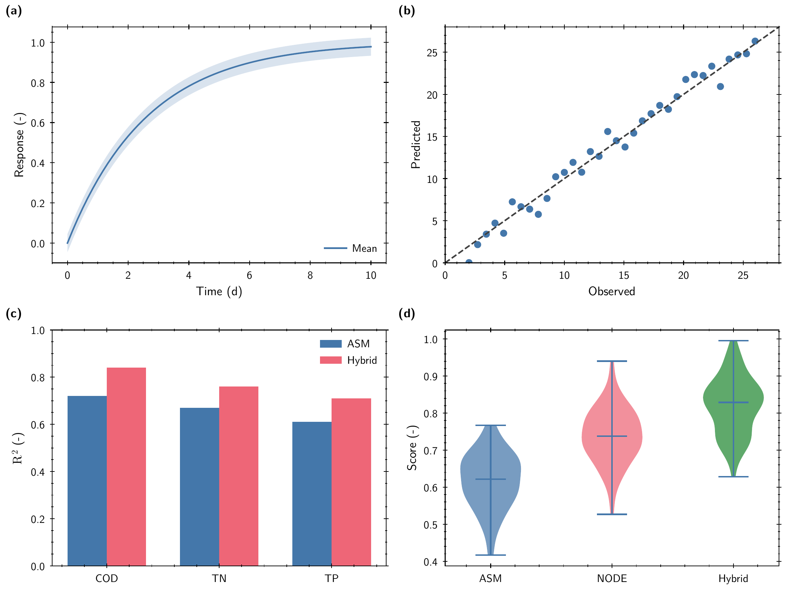
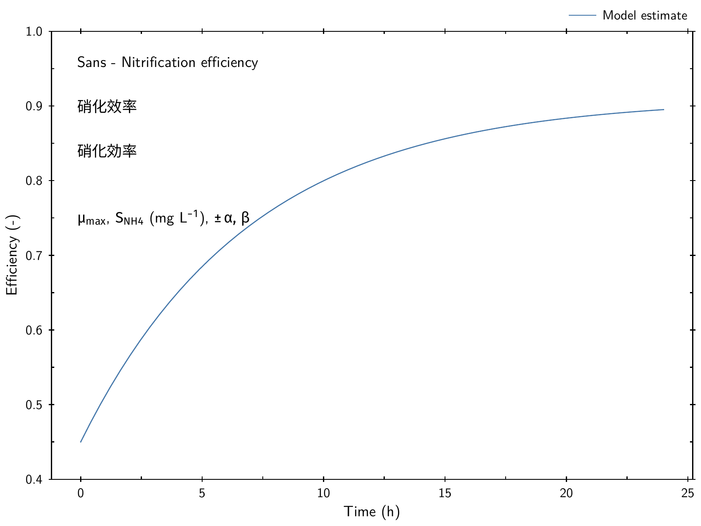
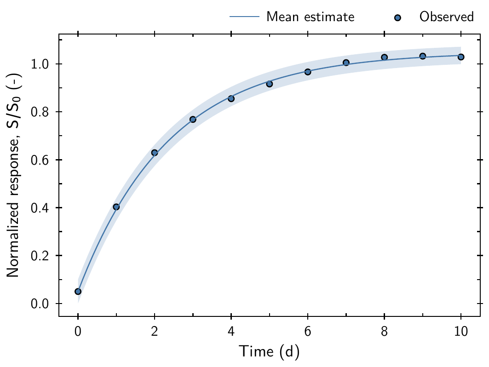
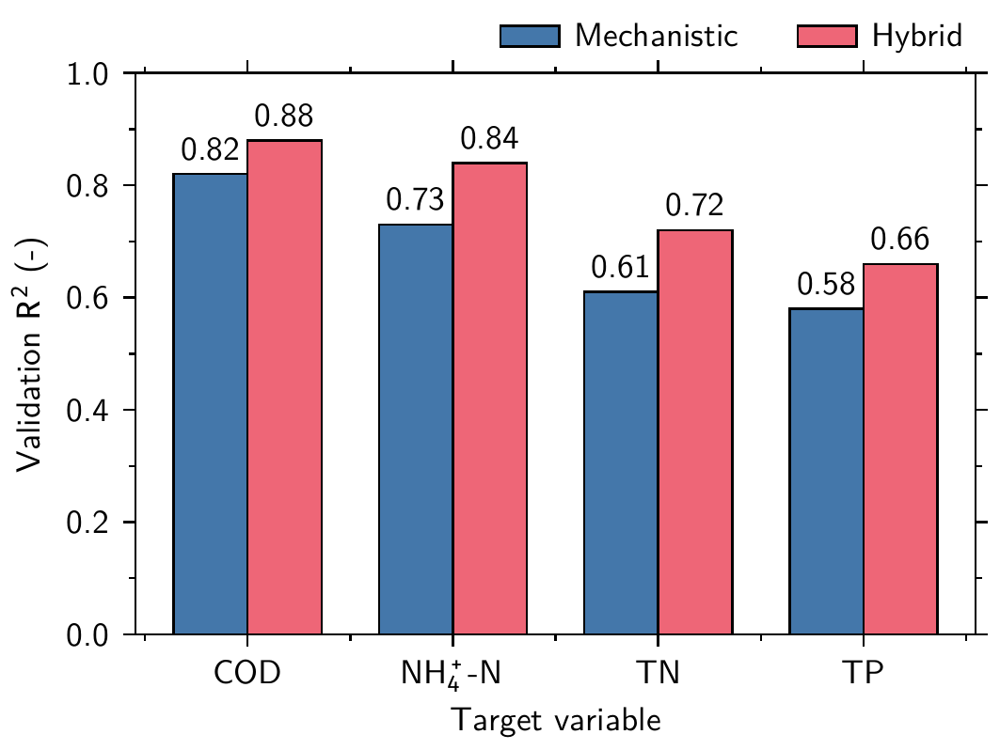

# AxiomFig

AxiomFig is a deterministic-first Agent Skill for publication-quality scientific figures. "Axiom" means that every visual rule that can be fixed should be fixed: the agent interprets data and scientific intent, selects a native Matplotlib template, composes tested style modules, and runs one rendering and validation pipeline. It does not invent font sizes, line widths, ticks, palettes, or export settings for every plot, and it is not another Matplotlib wrapper library.



## Architecture

```text
scientific intent -> template -> base + geometry + typography + color
                  -> plot + language + rendering -> Matplotlib vector PDF
                  -> standalone TeX -> Tectonic PDF -> validated PNG preview
```

The style stack uses native `.mplstyle` files. `src/axiomfig/` contains only thin deterministic mechanics: layer conflict detection, exact font discovery, template loading, Tectonic execution, gallery orchestration, and artifact validation. Plot grammar stays in runnable files under `templates/`.

## Quick start

Requirements: Python 3.11+, Tectonic, Poppler, and the exact font families below.

```bash
brew install tectonic poppler
brew install --cask font-latin-modern font-latin-modern-math font-noto-sans-cjk-sc font-noto-sans-cjk-jp
fc-cache -f

python -m pip install -e . --group dev
python scripts/check_fonts.py
python scripts/render.py line-ci --output tmp/demo/line \
  --geometry single-column --colors default --plot line
python scripts/validate.py tmp/demo
```

Compose an inspectable style file without rendering:

```bash
python scripts/compose_style.py \
  --geometry double-column --typography sans --colors muted \
  --plot line --language multilingual --rendering vector \
  --output tmp/composed.mplstyle
```

Layer order is fixed: `base -> geometry -> typography -> colors -> plot -> language -> rendering`. Undeclared key conflicts fail. See [the style contract](references/style-contract.md).

## First-round templates

The first release covers single/multi/marker/CI line plots; basic/grouped/parity scatter; vertical/grouped bars; boxplots and violins; annotated heatmaps; observed-predicted and residual evaluation; two- and four-panel layouts; and one multilingual pipeline probe. Each builder uses native Matplotlib and accepts adaptation for real data without restating global appearance.

## Multilingual typography

The exact contract is Latin Modern Sans for Latin text, Latin Modern Math for mathematics, Noto Sans CJK SC for Simplified Chinese, and Noto Sans CJK JP for Japanese. Discovery never silently falls back. Chinese and Japanese runs are explicitly mapped so shared Han characters use the intended regional glyphs.



## Tectonic and gallery

Matplotlib's PGF backend does not support `tectonic` as a `pgf.texsystem` value. AxiomFig instead writes a vector PDF intermediate, includes it in a standalone TeX document, invokes Tectonic for the final PDF, then rasterizes that exact PDF for the preview. Intermediate TeX/PDF/log files stay under `tmp/`; `gallery/` contains only final PDF/PNG pairs.

```bash
python scripts/build_gallery.py
python scripts/validate.py gallery
python -m pytest
ruff check .
ruff format --check .
```





Detailed routing lives in [SKILL.md](SKILL.md); typography and PDF evidence requirements are in [references/typography.md](references/typography.md) and [references/rendering-validation.md](references/rendering-validation.md).
