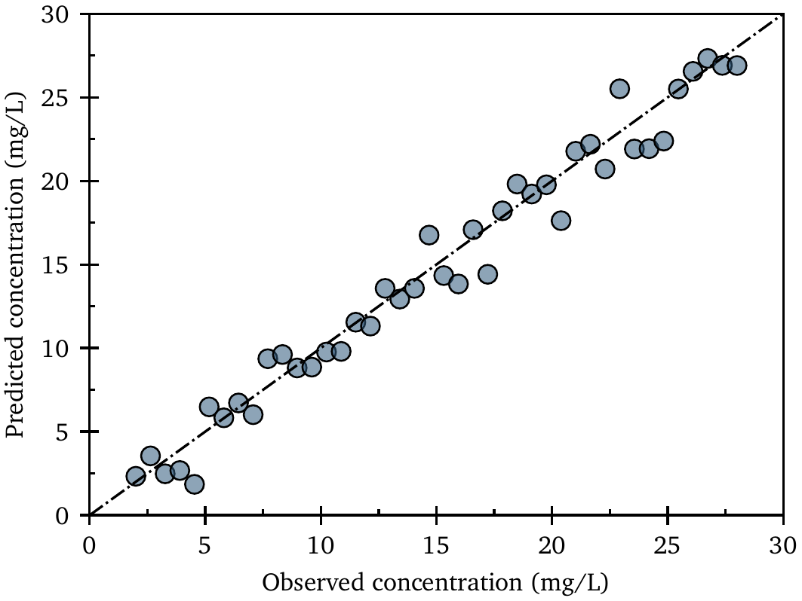
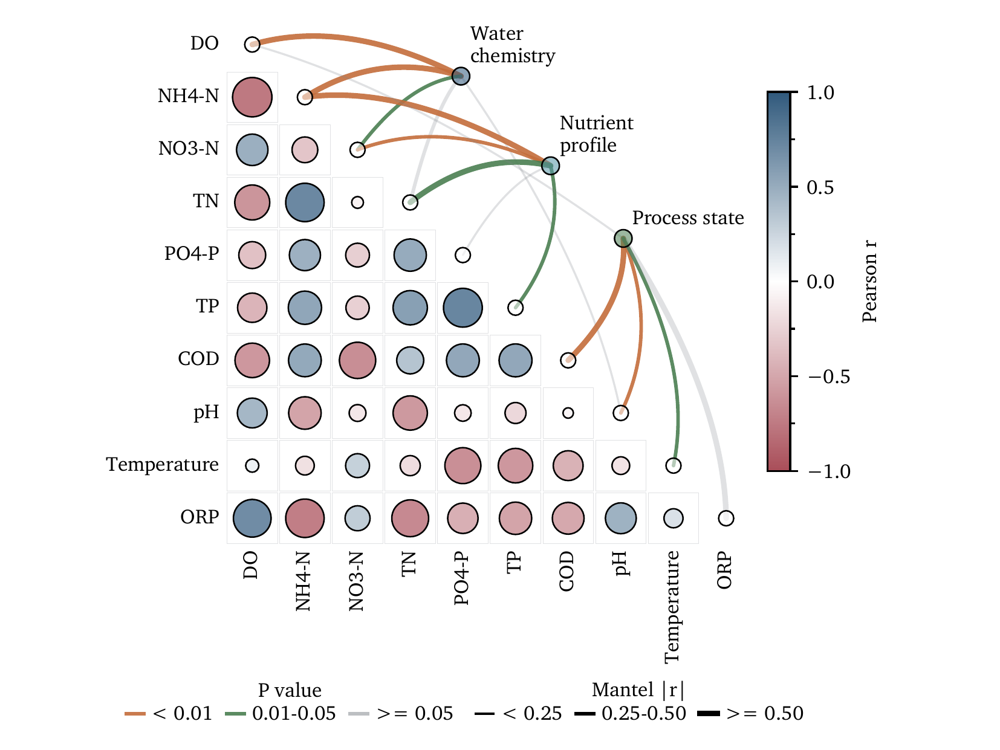
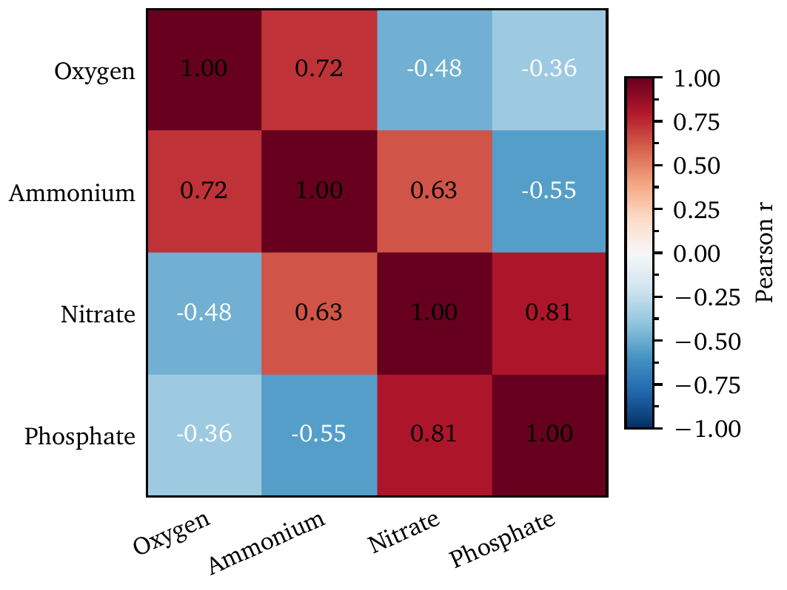

# AxiomFig

AxiomFig is a deterministic-first scientific figure Skill and Python runtime for LLM agents and
researchers. It turns scientific intent plus explicit data or precomputed results into validated,
publication-oriented PDF and PNG figures.

The central design rule is simple:

> If a visual decision can be made deterministically, the LLM should not make it.

The Agent decides scientific meaning. AxiomFig decides reusable visual details such as physical
geometry, typography, line widths, marker sizes, tick geometry, legend packing, colorbar placement,
panel spacing, and validation.

## Why this project exists

General plotting libraries are expressive, but an LLM that uses them directly must repeatedly
reason about many low-level choices. Those choices consume tokens, create visual drift, and make it
easy to confuse scientific intent with implementation detail.

AxiomFig inserts a small semantic layer between the Agent and Matplotlib:

```text
research request + data
        ↓
scientific intent
        ↓
registered template + family contract
        ↓
minimal Figure Intent
        ↓
deterministic AxiomFig runtime
        ↓
Matplotlib artists + validation
        ↓
PDF + PNG
```

This gives the Agent a narrower and safer job:

```text
Agent owns                          Runtime owns
────────────────────────────────    ────────────────────────────────
scientific figure type              physical dimensions
supplied data roles                 typography and fonts
uncertainty meaning                 line / marker / bar geometry
scientific color meaning            ticks and spines
explicit thresholds                 legend and colorbar placement
precomputed results                 panel and ornament spacing
semantic non-default requests       renderer measurement
                                    PDF / PNG validation
```

## Design principles

### 1. Deterministic first

Stable visual defaults live in YAML and runtime contracts. They are not regenerated by the LLM for
each figure. Font sizes, line widths, tick lengths, marker areas, margins, legend coordinates, and
colorbar geometry stay out of Figure Intent.

### 2. Scientific semantics before appearance

A visual request must not silently change scientific encoding. Asking for smaller scatter markers
does not authorize replacing observations with hexbin counts; asking to move a legend does not
authorize dropping series; resolving label collisions does not authorize removing mandatory
scientific labels.

### 3. Default first, exception second

Normal figures use deterministic defaults without reading style manuals. Only a genuine non-default
visual request opens the element-contract route:

```text
non-default request
        ↓
references/element-contracts/index.md
        ↓
one focused topic when possible
        ↓
AVAILABLE / INTERNAL_ONLY / PLANNED / NOT_SUPPORTED
```

If a researcher phrases the request using Matplotlib arguments, coordinates, or backend-specific
options, AxiomFig preserves the visual goal and discards the low-level implementation wording from
the public interface.

### 4. One public Agent-to-runtime boundary

[Figure Intent](references/figure-intent.md) is the only formal Agent-to-runtime figure
specification. Element contracts, Figure Anatomy, template knowledge, and runtime contracts are
knowledge and implementation layers; they do not form competing public schemas.

### 5. Matplotlib as renderer, AxiomFig as scientific contract layer

Matplotlib remains the rendering foundation. AxiomFig organizes its capabilities into reusable
scientific grammars, deterministic layout rules, ornament ownership, typography, and validation.
External layout or annotation tools may be used internally only when evidence justifies them; the
Agent never selects backend-specific parameters.

## Repository architecture

The repository follows a conventional Skill layout while keeping the executable plotting runtime in
the same project:

```text
axiomfig/
├── SKILL.md                     # short Agent entry point and routing
├── references/                  # progressive-disclosure knowledge
│   ├── element-contracts/       # default → exception → adjustment surface
│   ├── template-knowledge/      # scientific template recommendation knowledge
│   └── *.md                     # protocol, Figure Intent, runtime contracts
├── src/axiomfig/                # deterministic Python runtime
│   ├── templates/               # registry, family contracts, adapters, builders
│   └── resources/               # styles, colors, fonts, LaTeX resources
├── examples/                    # minimal user-facing examples
├── scripts/                     # validation, evaluation, Gallery utilities
├── tests/                       # unit, integration, evaluation, release checks
├── gallery/                     # rendered visual evidence
└── reports/                     # task specifications and audit reports
```

The important separation is conceptual rather than directory-heavy:

```text
1. Agent layer
   SKILL.md → protocol → routed knowledge

2. Contract layer
   template registry → family contract → Figure Intent

3. Deterministic runtime
   adapter → builder → style → layout → ornaments → typography → validation

4. Evidence layer
   tests → Gallery → evaluation → reports
```

The source package intentionally remains compact. Benchmark and audit code stays outside
`src/axiomfig/` so experimental infrastructure cannot become production architecture by accident.

## Element contracts

[Scientific Figure Anatomy](references/figure-anatomy.md) defines the vocabulary of a figure:
canvas, regions, axes, scientific artists, ornaments, annotations, ownership, and spatial
relations.

[Element Contracts](references/element-contracts/index.md) answer a different question:

> When a user asks for a non-default treatment, what may the Agent change and through which AxiomFig
> surface?

The four focused topics are:

```text
axes.md         axis scale, limits, ticks, labels, panel/axis topology
marks.md        lines, markers, bars, fills, intervals, matrix/field marks
ornaments.md    legends, colorbars, panel labels, support regions
annotations.md  labels, collisions, connectors, significance annotations
```

Each adjustment is classified as:

- `AVAILABLE` — executable through a real current public AxiomFig surface;
- `INTERNAL_ONLY` — runtime-owned but not public Agent control;
- `PLANNED` — useful semantic capability with no current executable surface;
- `NOT_SUPPORTED` — intentionally outside the current public architecture.

Stable numeric defaults remain only in the executable style/runtime sources of truth.

## Template system

AxiomFig exposes a registry-defined public template surface across 13 scientific plot families.
Every public template accepts external structured input: direct data or explicit precomputed
results. Counts are derived from the committed registry rather than duplicated here.

| Families | Typical role |
|---|---|
| `line`, `scatter`, `bar`, `distribution`, `heatmap` | Core scientific comparison and distribution |
| `estimation`, `diagnostics`, `survival` | Uncertainty and model evaluation |
| `ordination`, `association`, `omics` | Multivariate and domain results |
| `field`, `flow` | Continuous fields and transport structure |

`layouts` is a separate set of canonical composition fixtures rather than a general nested
user-data composition API. Advanced Mantel behavior is documented in
[references/mantel.md](references/mantel.md).

The compact registry is [src/axiomfig/templates/index.yaml](src/axiomfig/templates/index.yaml).

## Installation

AxiomFig has two parts:

1. the Skill checkout (`SKILL.md` and `references/`) used by an Agent;
2. the Python runtime and CLI used to build and validate figures.

A pip installation alone does not provide the Skill documents to an Agent. Keep the repository or
installed Skill directory available to the Agent and install the runtime into its execution
environment.

The latest tagged stable runtime is currently `v1.1.0`:

```bash
brew install tectonic poppler
python -m pip install "axiomfig @ git+https://github.com/cigit-zgy/axiomfig.git@v1.1.0"
```

For development from a source checkout:

```bash
python -m pip install -e ".[dev]"
```

Python 3.11 and 3.12 are supported.

## Quick start

The committed parity example uses the complete public path:

```bash
axiomfig-intent examples/parity/intent.yaml \
  --data examples/parity/data.csv \
  --output parity
```

Its Figure Intent stays small:

```yaml
template: scatter.parity
data:
  observed: observed
  predicted: predicted
geometry: single-column
typography: sans
```

The command writes and validates `parity.pdf` and `parity.png`.

## Agent workflow

For a normal request the Agent follows:

```text
request + data schema
→ references/agent-protocol.md
→ optional routed template knowledge
→ template registry
→ one family contract
→ minimal Figure Intent
→ axiomfig-intent
→ validated artifacts
```

For a non-default visual request it additionally uses the element index and normally one focused
element topic. It should never search all builders or read every reference for ordinary use.

See [SKILL.md](SKILL.md) for the executable routing policy.

## Gallery and evidence

The formal registry-driven Gallery is a curated serif-only, family-first evidence tree. Sans
typography remains an executable runtime mode. Technical and capability evidence lives under the
evaluation suite rather than the user-facing Gallery.

| Parity | Mantel | Correlation heatmap |
|---|---|---|
|  |  |  |

A complex-figure capability audit showed that Matplotlib can express all tested complex statistical
figures, while public AxiomFig coverage and movable-annotation semantics remain deliberately
curated. An element-routing A/B evaluation further showed substantially lower reference fan-out and
higher correctness in identifying public/runtime/planned adjustment boundaries. These evaluations
are development evidence; they do not turn benchmark-only figure grammars into public APIs.

## Validation

AxiomFig validates both figure structure and final artifacts. Checks include panel geometry,
Primary/Auxiliary containment, legends, colorbars, annotations, output bounds, font embedding, PDF
structure, and PNG generation from the final PDF.

A valid release figure must remain reproducible and publication-oriented; validation failure is
reported rather than bypassed.

See [references/validation.md](references/validation.md).

## Typography and LaTeX

The canonical Latin stacks use open bundled fonts including Latin Modern Sans, XCharter, compatible
math fonts, and Maple Mono. Matplotlib creates vector scientific graphics; Tectonic is used for
final publication-page handling where required.

See [references/typography.md](references/typography.md) and
[references/latex-contract.md](references/latex-contract.md).

## Development and release checks

```bash
ruff check .
ruff format --check .
python -m pytest -q
python scripts/validate_skill.py
python scripts/evaluate_release.py --output tmp/release-evaluation
```

Release work additionally verifies the registry-driven Gallery, repeatability, bundled fonts,
Tectonic/PDF integrity, isolated wheel installation, clean-clone CLI behavior, and Python 3.11/3.12
CI. See [CONTRIBUTING.md](CONTRIBUTING.md).

## Scope

AxiomFig is a curated scientific figure system. It does not claim arbitrary scientific-figure
composition or general-purpose graphics automation. Current public scope is defined by the template
registry and Figure Intent contracts.

Capabilities such as general nested user-data composition, shared cross-panel ornaments, and a
general collision-aware annotation service may be promoted only after they have an executable
consumer and deterministic contract. Interactive graphics, animation, GIS, microscopy, chemical
structures, and broad 3D graphics are outside the current core scope.

## Acknowledgements and license

The deterministic design is informed by Nicolas P. Rougier's *Scientific Visualization: Python +
Matplotlib*. See [references/design-rationale.md](references/design-rationale.md) for attribution and
design consequences.

AxiomFig is released under the [MIT License](LICENSE).
