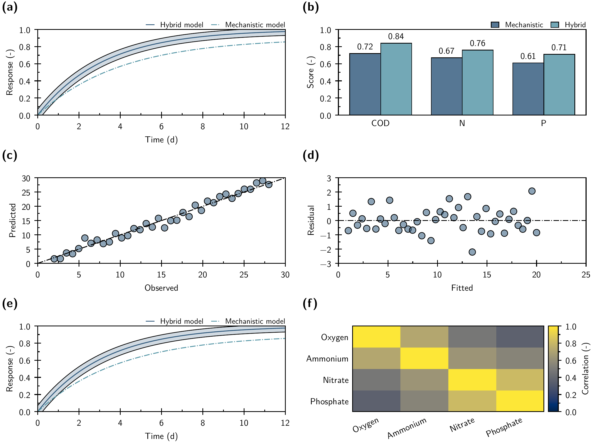
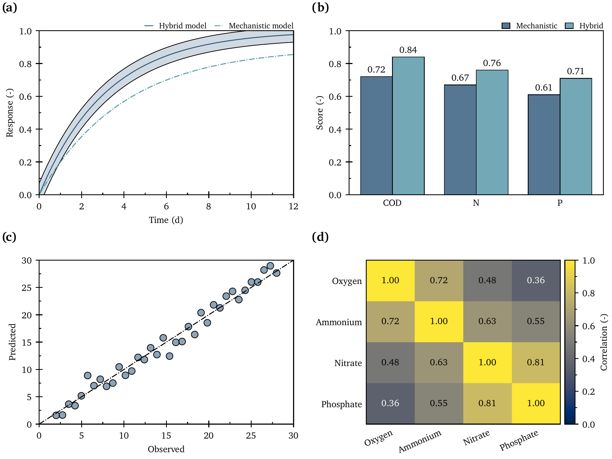
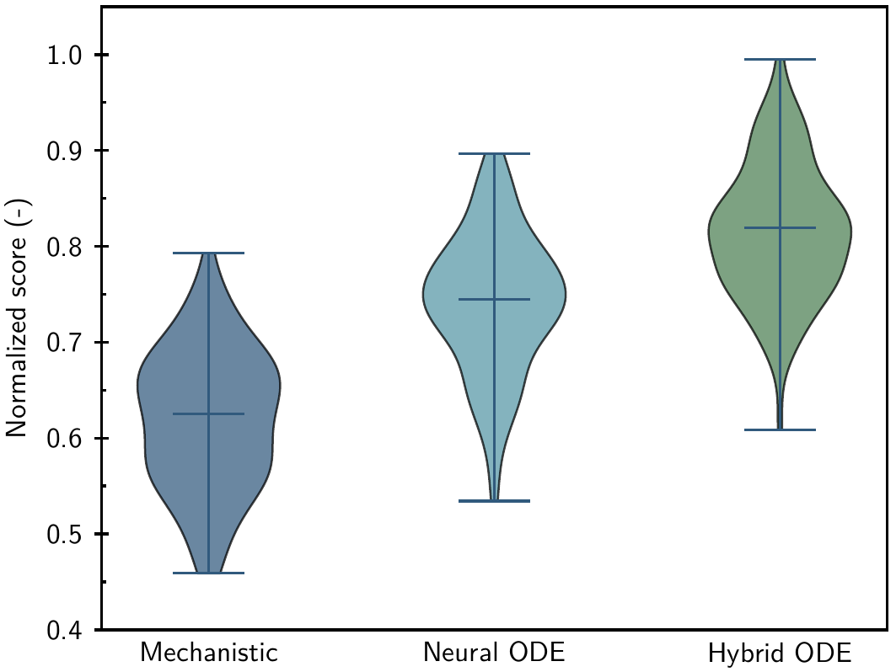
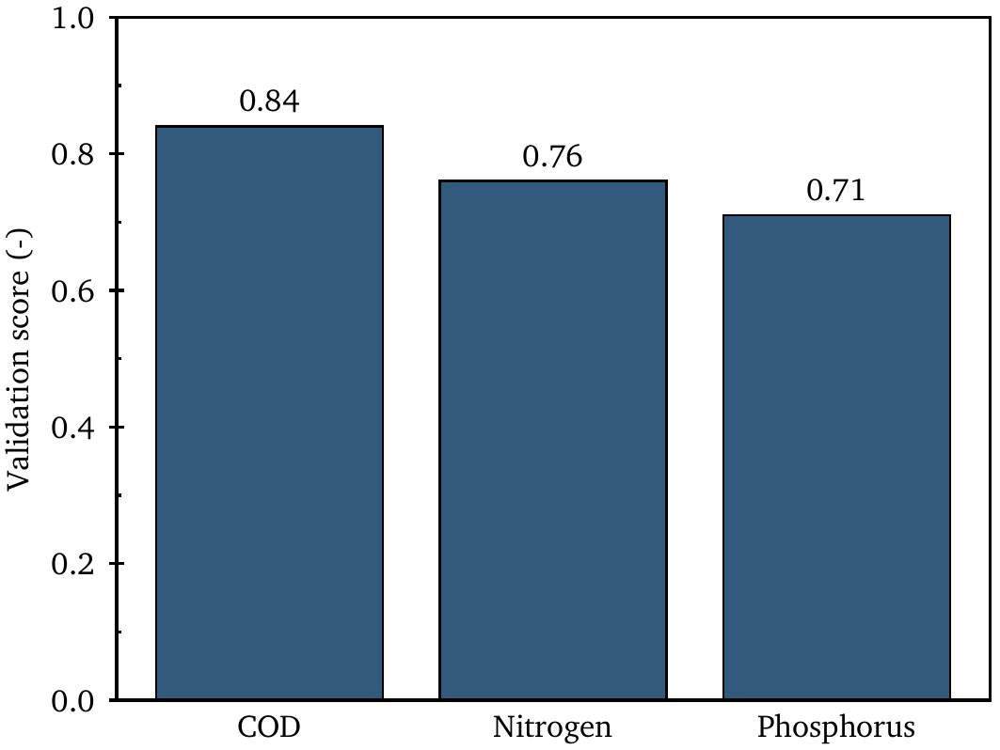

# AxiomFig

AxiomFig is a deterministic-first Agent Skill for publication-quality scientific figures. Scientific meaning stays in a small set of native Matplotlib builders; all reusable visual decisions come from three YAML contracts and thin helpers.









## Architecture

```text
styles/style.yaml ─┐
styles/fonts.yaml ─┼─> thin YAML loader -> rcParams/tokens -> template family
styles/colors.yaml ┘                              -> Matplotlib vector PDF
                                                   -> Tectonic final PDF
                                                   -> Poppler preview PNG
```

The three canonical sources have exclusive responsibilities:

- `style.yaml`: geometry, physical font sizes, strokes, ticks, nice axes, legends, panels, plot defaults, and rendering;
- `fonts.yaml`: exact Latin/math/mono families, files, sources, licenses, redistribution status, and optional system fonts;
- `colors.yaml`: canonical scientific palettes.

There are no `.mplstyle` layers. Thirty-six public templates are grouped into four small family modules under `src/axiomfig/templates/`; see the [template contract](references/template-contract.md).

Runtime LaTeX files and redistributable fonts/licenses live only under `src/axiomfig/resources/` and remain available through `importlib.resources` after wheel installation.

## Quick start

Requirements are Python 3.11+, Tectonic, Poppler, PyYAML, and the exact fonts selected by the typography contract.

```bash
brew install tectonic poppler
python -m pip install -e .

python scripts/check_fonts.py
python scripts/render.py single-line --output "$PWD/tmp/demo/single-line" \
  --geometry single-column --typography sans
python scripts/validate.py tmp/demo
```

Installed commands are `axiomfig-render`, `axiomfig-validate`, and `axiomfig-gallery`.

## Frozen visual contract

- Physical widths are 90, 140, and 190 mm at default 4:3; point sizes do not scale with width.
- `main_stroke = 0.8 pt`; black filled-geometry edges use `fill_edge = 0.6 pt`.
- Open continuous axes use major `inout`, minor `in`, and one minor per major interval. The minor is `1.854 pt`; the major parameter is derived from the measured `inout` projection and φ ratio. Filled surfaces/colorbars reuse these lengths with `out`; categorical axes keep labels but no tick marks.
- Nice linear axes target 5–7 majors with steps limited to `1`, `2`, `2.5`, or `5 × 10^n`, half-step minors, and snapped limits.
- Single-series figures omit legends. Multi-series legends are Figure-level Ornaments with explicit zero border padding, a physical top gap, measured `N..1` columns, and collision/boundary validation.
- Panel labels are bold `(a)`, `(b)`, … at `11 pt` with fixed point offsets from equal registered Outer Panel Footprints. A colorbar is contained Auxiliary Axes and never expands its footprint or compresses a peer panel.
- Filled geometry stores transparency only in face RGBA; black `0.6 pt` edges remain opaque. Scatter uses face alpha `0.55` and `36 pt²` markers. Bars use exact width `0.60`, or total group width `0.76`, and show two-decimal values.
- Multi-series identity redundantly cycles color, line style, and marker. The first four line styles are solid, dash-dot, dotted, and long-dash; reference lines default to dash-dot.
- Registered grids use a one-measurement physical layout solve and runtime anatomy validation. Single panels retain the fixed-page output solver; both preserve 90/140/190 mm geometry and the canonical `1.5 pt` output padding.
- `sans` uses bundled Latin Modern Sans for text and Matplotlib math; `serif` uses bundled XCharter + XCharter Math; both use bundled Maple Mono. CJK/Japanese work is deferred.

See [SKILL.md](SKILL.md), [the style contract](references/style-contract.md), [typography](references/typography.md), [layout](references/layout-contract.md), [validation](references/validation-contract.md), and [the template contract](references/template-contract.md).

## LaTeX boundary

[The LaTeX contract](references/latex-contract.md) records exact allowed syntax for `siunitx`, `mhchem`, `amsmath`, `unicode-math`, and `xcolor`. `gallery/latex/` contains two genuinely Tectonic-native references. The Matplotlib renderer still embeds plot text before Tectonic wraps the intermediate PDF, so TeX-native macro expansion inside Matplotlib labels remains **DEFERRED**.

## Gallery and validation

The committed Gallery contains matching English-only suites under `gallery/sans/` and `gallery/serif/`. Each mode has 36 canonical PDF/PNG pairs (`01_single_line` through `36_complex_multi_panel`). `gallery/latex/` adds two Tectonic-native pairs, for 74 pairs and 148 final artifacts in total.

```bash
python scripts/generate_colors.py --check
python scripts/check_fonts.py
python scripts/build_gallery.py
python scripts/validate.py gallery
python -m pytest -q
ruff check .
ruff format --check .
```

Tests cover deterministic normal, boundary, and overflow/error behavior. The one real-PDF E2E covers the canonical Gallery. Completion still requires human inspection of every final PNG for strokes, ticks, categorical axes, marker/bar/violin edges, labels, legends, panel symmetry, colorbar layout, clipping, and sans/serif consistency.
